# 📚 Library Management System

A modern **Library Management System** developed using **ASP.NET Core MVC (.NET 9)**, **Entity Framework Core**, and **MySQL**.

The application provides a centralized platform for managing books, students, librarians, publications, and borrowing records through a clean and user-friendly interface.

The project was developed to demonstrate the implementation of the **Model-View-Controller (MVC)** architecture, CRUD operations, session-based authentication, inventory management, and database integration using Entity Framework Core.

---

# ✨ Features

## Authentication

- Session-based Login
- Logout
- Protected Routes

## Dashboard

- Library Statistics
- Available Books
- Borrowed Books
- Low Stock Books
- Out of Stock Books
- Recent Borrow Records
- Recent Publications

## Books

- Add Book
- Edit Book
- Delete Book
- Search
- Pagination
- Borrow Books
- Inventory Management
- Multiple Copies Support

## Students

- CRUD Operations
- Search
- Pagination

## Librarians

- CRUD Operations
- Search
- Pagination

## Publications

- Newspapers
- Magazines
- CRUD Operations
- Search
- Pagination

## Borrowing

- Borrow Books
- Borrow History
- Automatic Inventory Update

---

# 🛠 Technology Stack

| Layer | Technology |
|--------|------------|
| Framework | ASP.NET Core MVC (.NET 9) |
| Language | C# |
| ORM | Entity Framework Core |
| Database | MySQL |
| Frontend | Razor Views |
| Styling | Bootstrap 5 |
| IDE | Visual Studio Code |
| Version Control | Git |

---

# 🏗 Architecture

The project follows the **MVC (Model-View-Controller)** architecture.

```text
Browser
      │
      ▼
 Razor Views
      │
      ▼
 Controllers
      │
      ▼
 Entity Framework Core
      │
      ▼
 LibraryContext
      │
      ▼
 MySQL Database
```

---


## Architecture

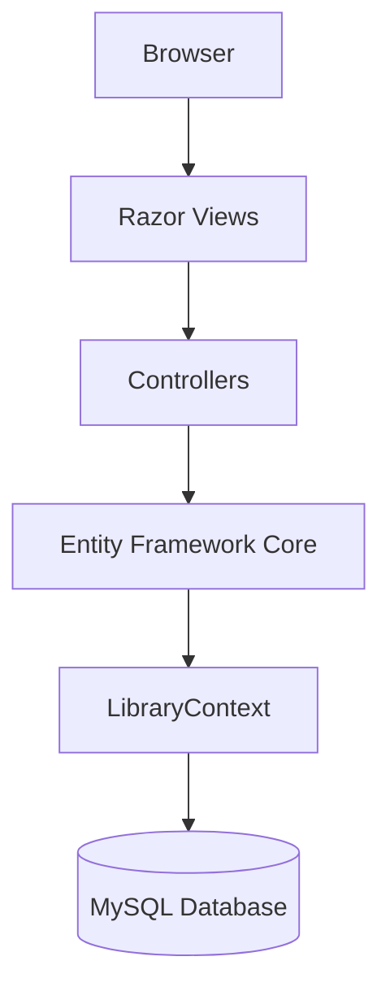


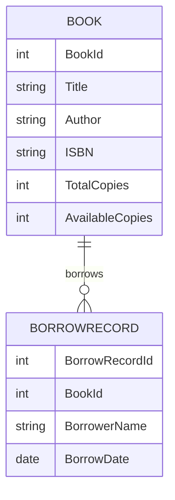


# 📁 Project Structure

```text
LibraryManagement/

├── Controllers/
├── Models/
├── Views/
├── Data/
├── Migrations/
├── wwwroot/

├── Program.cs
├── appsettings.json
├── README.md

└── docs/
```

---

# 🚀 Getting Started

Clone the repository

```bash
git clone <repository-url>
```

Restore packages

```bash
dotnet restore
```

Apply migrations

```bash
dotnet ef database update
```

Run the application

```bash
dotnet run
```

---

# 📖 Documentation

Detailed documentation is available inside the **docs/** folder.

- Project Overview
- Architecture
- Technology Stack
- Database Schema
- Features
- Setup Guide
- Design Decisions
- Future Scope

---

# 📌 Future Enhancements

- Role-based Authentication
- Fine Management
- Email Notifications
- Barcode Scanner Integration
- Book Reservation
- Reports & Analytics
- Cloud Deployment

---

## 📸 Application Preview

### 🔐 Login
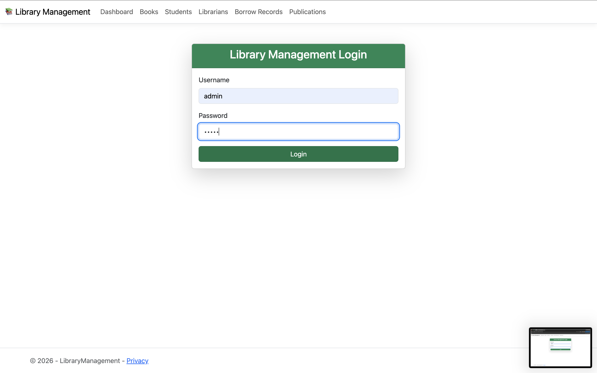

---

### 📊 Dashboard
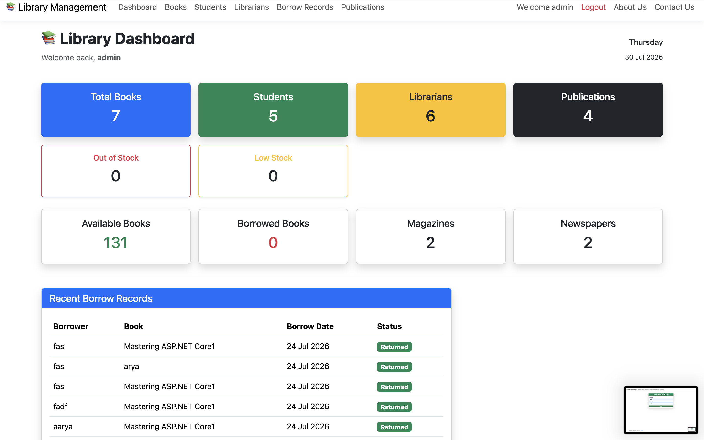
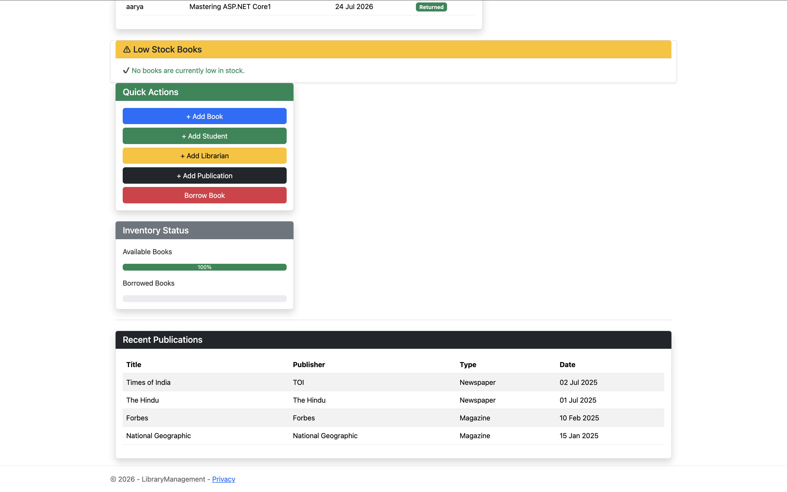

---

### 📚 Books
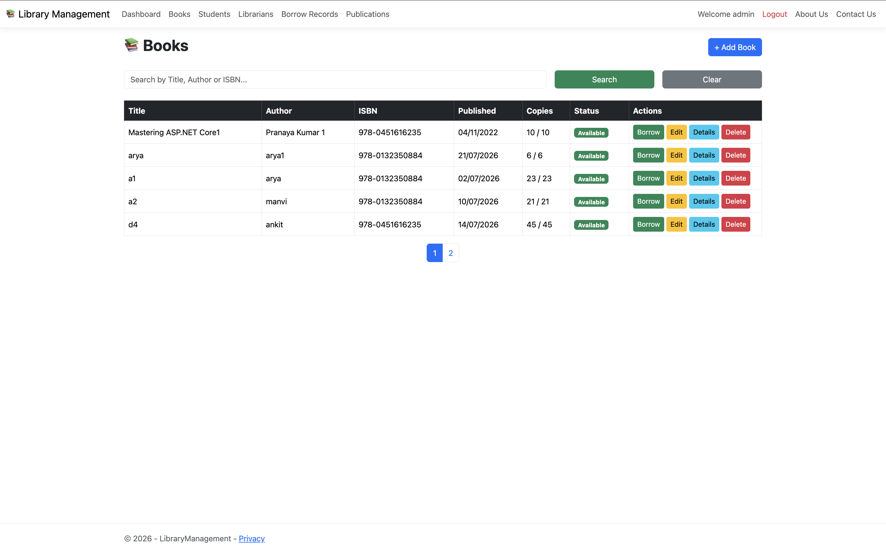

---

### 👨‍🎓 Students
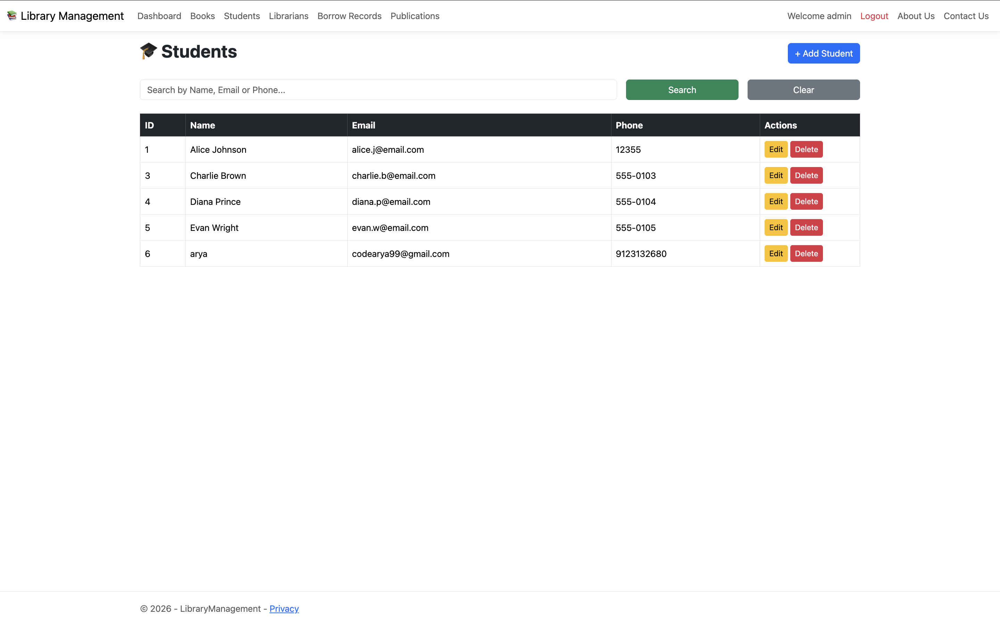

---

### 👩‍💼 Librarians
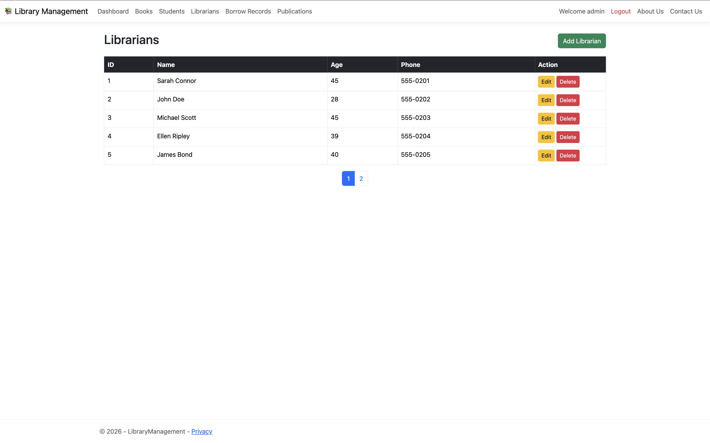

---

### 📰 Publications
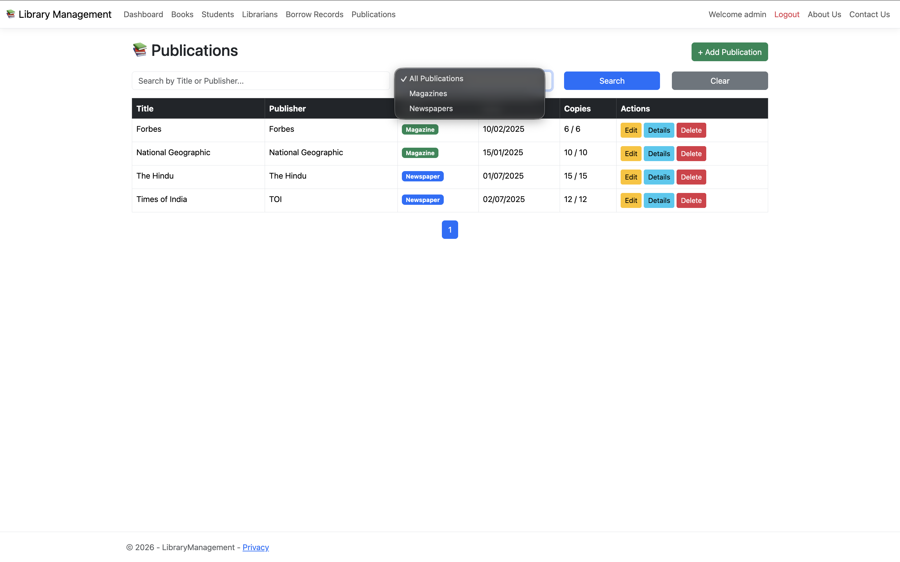

---

### 📖 Borrow Book
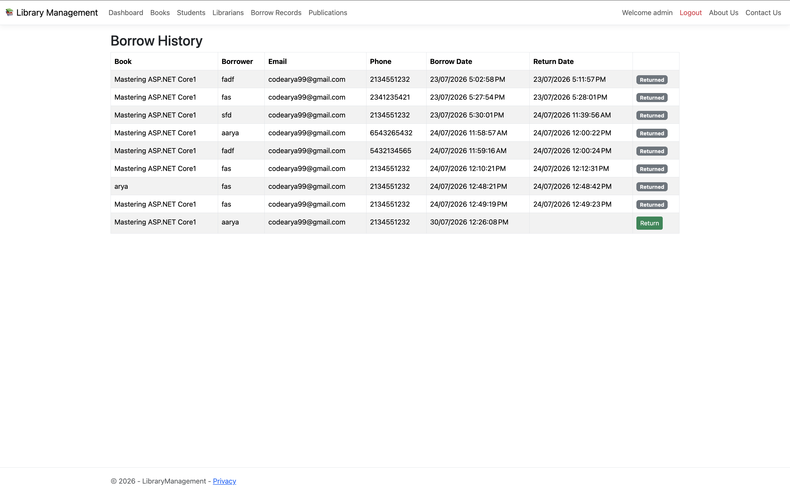

---

### ℹ️ About
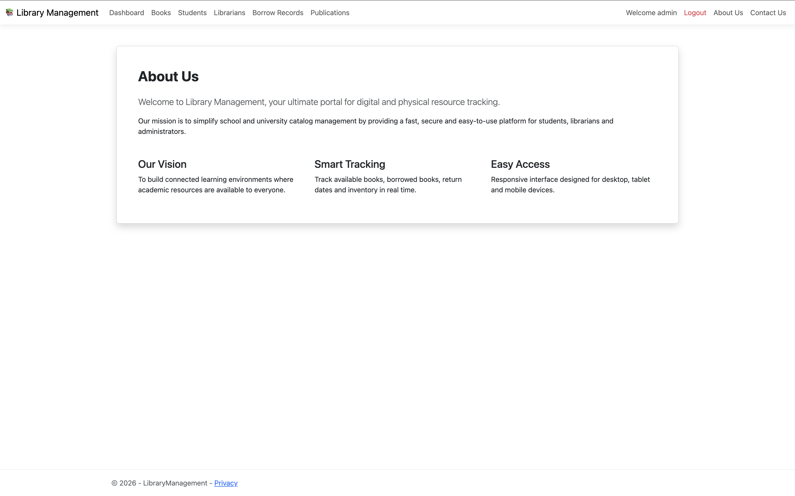

---

### 📞 Contact
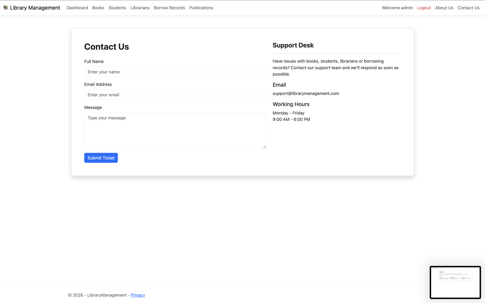

# 👨‍💻 Author

**Kumar Arya**

B.Tech Computer Science Engineering

---

# 📄 License

This project is intended for educational purposes.