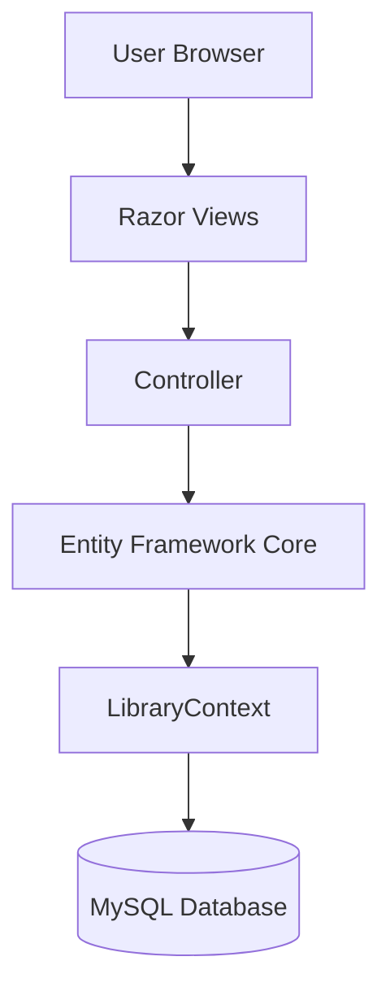
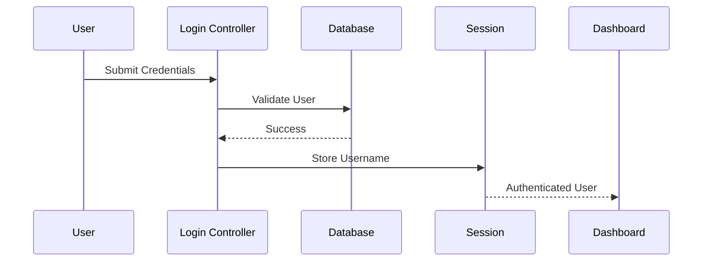
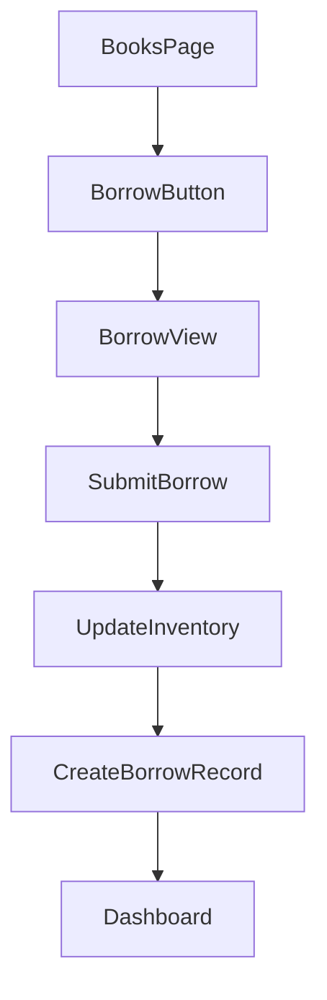

# Project Architecture

> **Purpose**
>
> This document explains the architectural design of the Library Management System, how requests flow through the application, and the responsibilities of each layer.

---

# Architecture Style

The application follows the **Model-View-Controller (MVC)** architectural pattern provided by ASP.NET Core.

MVC separates the application into three main components:

- Model
- View
- Controller

This separation improves maintainability, readability, and scalability.

---

# High-Level Architecture



---

# Request Flow

A typical request follows this sequence:

```text
Browser

↓

Controller

↓

Business Logic

↓

Entity Framework Core

↓

MySQL

↓

Entity Framework Core

↓

Controller

↓

Razor View

↓

Browser
```

---

# MVC Responsibilities

## Model

The Model represents application data.

Responsibilities include:

- Entity Classes
- ViewModels
- Validation Rules
- Business Data

Examples

```text
Book

Student

Publication

BorrowRecord

DashboardModel

BookListViewModel
```

---

## View

Views are Razor (.cshtml) pages.

Responsibilities:

- Display data
- Collect user input
- Render HTML

Views should contain minimal logic.

Business logic should never be implemented inside Views.

---

## Controller

Controllers coordinate the application.

Responsibilities

- Receive HTTP Requests
- Validate User Input
- Execute Business Logic
- Query Database
- Return Views

Examples

```text
HomeController

LoginController

DashboardController

BooksController

StudentsController

LibrariansController

PublicationController
```

---

# Layer Responsibilities


---

# Folder Structure

## Controllers

Contains all MVC Controllers.

Each module has its own controller.

Examples

```text
BooksController

StudentsController

DashboardController

PublicationController
```

---

## Models

Contains:

- Entity Models
- View Models
- Enums

Example

```text
Book

BorrowRecord

Publication

DashboardModel

BorrowViewModel

BookListViewModel
```

---

## Views

Contains Razor Views.

Organized by controller.

Example

```text
Views

Books

Students

Dashboard

Publication

Shared
```

---

## Data

Contains

```text
LibraryContext
```

Responsible for Entity Framework Core configuration and database access.

---

## Migrations

Stores Entity Framework migration history.

Generated using:

```bash
dotnet ef migrations add MigrationName
```

---

## wwwroot

Contains static assets.

Examples

```text
CSS

JavaScript

Images

Bootstrap Files
```

---

# Database Access

The application uses **Entity Framework Core** with the **Code First** approach.

Advantages:

- Strongly typed entities
- Automatic migrations
- LINQ queries
- Reduced boilerplate code

No raw SQL is used for normal CRUD operations.

---

# Authentication Flow

The application uses **Session-Based Authentication**.



Unauthenticated users are redirected to the Login page.

---

# Borrowing Flow



Borrowing is initiated from the Books module because a book must first be selected.

---

# Inventory Management

Instead of storing a simple availability flag, the application maintains:

- TotalCopies
- AvailableCopies

Borrowing decreases AvailableCopies.

Returning a book increases AvailableCopies.

This approach supports multiple physical copies of the same book.

---

# Publication Management

Magazines and Newspapers are stored in a single table.

A PublicationType enumeration distinguishes between them.

Advantages:

- Simpler schema
- Easier maintenance
- Less duplicated code

---

# Error Handling

Current implementation includes:

- Model validation
- Null checks
- Entity existence checks
- Redirects for invalid requests

Future improvements may include:

- Global exception handling
- Custom error pages
- Logging

---

# Design Principles

The project follows these principles:

- Separation of Concerns
- Single Responsibility
- Reusable ViewModels
- Entity Framework Code First
- Incremental Development

The project intentionally avoids unnecessary architectural complexity such as Repository and Unit of Work patterns because they are not required for the current scope.

---

# Future Architecture Improvements

Potential enhancements include:

- Service Layer
- Repository Pattern
- Dependency Injection for services
- Role-Based Authorization
- REST API
- Cloud Deployment
- Unit Testing
- Integration Testing