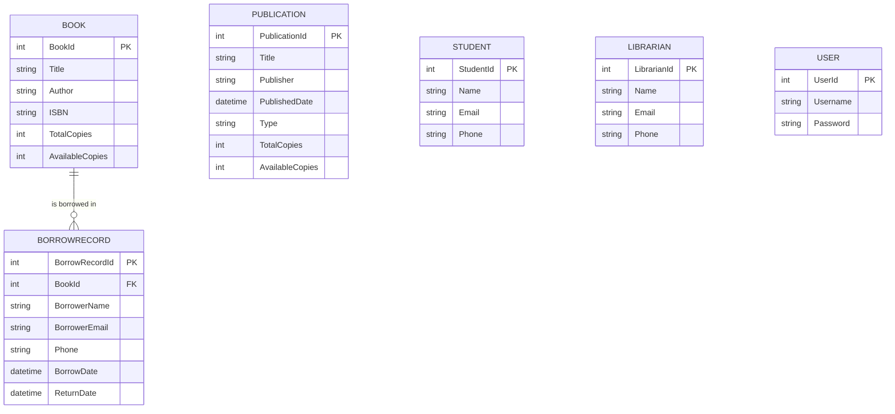

# Database Design

> **Purpose**
>
> This document describes the database structure used by the Library Management System, including tables, relationships, and business rules.

---

# Database Information

| Property | Value |
|----------|-------|
| Database | MySQL |
| ORM | Entity Framework Core |
| Approach | Code First |
| Context Class | LibraryContext |

---

# Database Tables

The application currently consists of the following tables:

- Users
- Books
- Students
- Librarians
- Publications
- BorrowRecords

---

# Entity Relationship Diagram

---

# Table Details

## Users

Purpose:

Stores login credentials for authorised users.

| Column | Type | Description |
|--------|------|-------------|
| UserId | int | Primary Key |
| Username | string | Login Username |
| Password | string | User Password |

---

## Books

Purpose:

Stores library book inventory.

| Column | Type | Description |
|--------|------|-------------|
| BookId | int | Primary Key |
| Title | string | Book Title |
| Author | string | Author Name |
| ISBN | string | ISBN Number |
| TotalCopies | int | Total copies owned |
| AvailableCopies | int | Copies currently available |

---

## BorrowRecords

Purpose:

Stores borrowing history.

| Column | Type | Description |
|--------|------|-------------|
| BorrowRecordId | int | Primary Key |
| BookId | int | Foreign Key |
| BorrowerName | string | Borrower's Name |
| BorrowerEmail | string | Email Address |
| Phone | string | Contact Number |
| BorrowDate | DateTime | Borrow Date |
| ReturnDate | DateTime | Return Date (nullable if not yet returned) |

Relationship:

One Book → Many Borrow Records

---

## Students

Purpose:

Stores student information.

| Column | Type | Description |
|--------|------|-------------|
| StudentId | int | Primary Key |
| Name | string | Student Name |
| Email | string | Email Address |
| Phone | string | Contact Number |

---

## Librarians

Purpose:

Stores librarian information.

| Column | Type | Description |
|--------|------|-------------|
| LibrarianId | int | Primary Key |
| Name | string | Librarian Name |
| Email | string | Email Address |
| Phone | string | Contact Number |

---

## Publications

Purpose:

Stores newspapers and magazines.

A single table is used together with the `PublicationType` enum.

| Column | Type | Description |
|--------|------|-------------|
| PublicationId | int | Primary Key |
| Title | string | Publication Title |
| Publisher | string | Publisher Name |
| PublishedDate | DateTime | Publication Date |
| Type | enum | Magazine / Newspaper |
| TotalCopies | int | Total copies |
| AvailableCopies | int | Available copies |

---

# Relationships

## Book → BorrowRecord

Relationship:

One-to-Many

One book can appear in multiple borrow records.

Each borrow record belongs to exactly one book.

---

# Business Rules

## Book Inventory

The project does **not** use an `IsAvailable` flag.

Instead it stores:

- TotalCopies
- AvailableCopies

Reason:

The library may own multiple copies of the same book.

---

## Borrowing

When a book is borrowed:

- A BorrowRecord is created.
- AvailableCopies decreases by one.

When a book is returned (future enhancement):

- AvailableCopies will increase by one.
- ReturnDate will be updated.

---

## Publications

Magazines and Newspapers share the same table.

They are distinguished using the `PublicationType` enum.

This avoids duplicate tables and duplicate CRUD logic.

---

# Entity Framework Strategy

The project uses:

- Code First
- Migrations
- LINQ Queries
- Navigation Properties where required

Database schema changes are managed using Entity Framework migrations rather than manual SQL scripts.

---

# Data Integrity

Current validation rules include:

- Required fields
- Primary keys
- Foreign key relationships
- Inventory consistency (`AvailableCopies <= TotalCopies`)
- Borrowing allowed only when copies are available

---

# Future Database Improvements

Potential future enhancements:

- Student ↔ BorrowRecord relationship
- Librarian ↔ BorrowRecord relationship
- Fine Management table
- Reservation table
- Audit logs
- Soft Delete support
- Database indexing for search optimisation